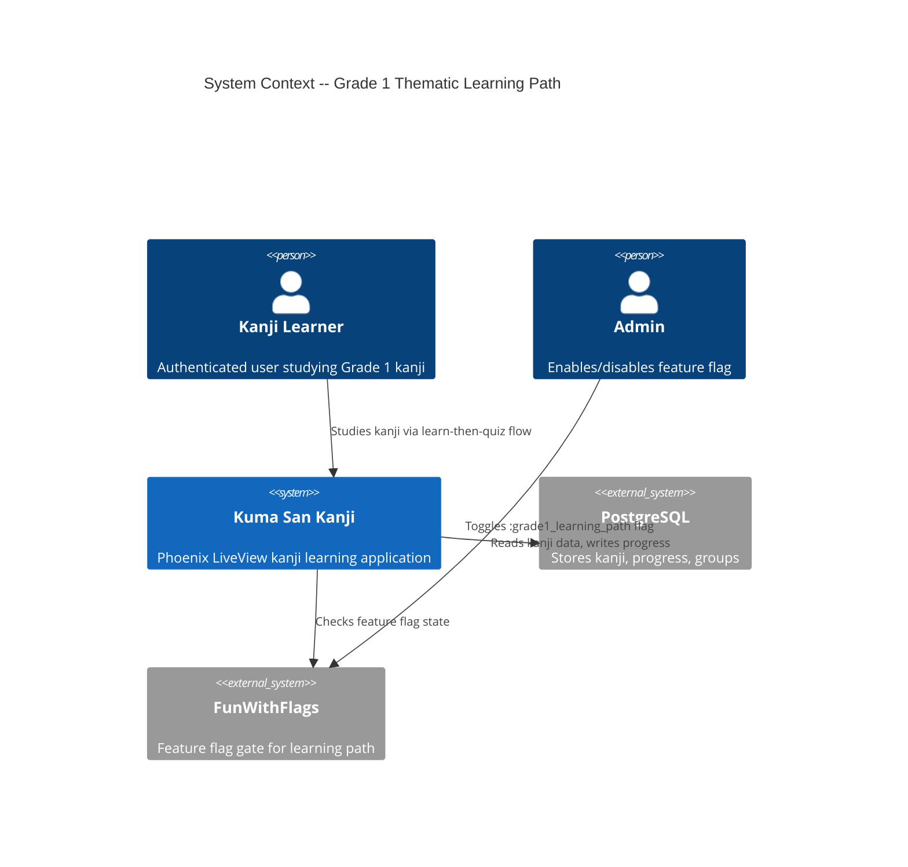
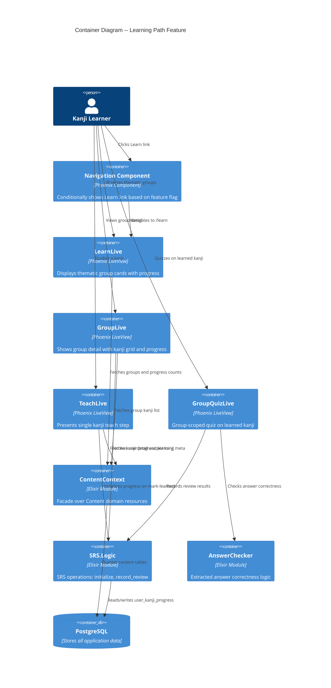

# Architecture: Grade 1 Thematic Learning Path (Release 1)

**Feature**: grade1-thematic-learning-path
**Wave**: DESIGN
**Date**: 2026-03-11
**Status**: Ready for DISTILL handoff

---

## 1. System Context

This feature adds a structured learn-then-quiz flow to an existing kanji learning application. It introduces no new external systems -- it composes existing Ash resources (Content domain, SRS domain, Kanji domain) behind new LiveView pages gated by a FunWithFlags feature flag.



## 2. Container Diagram



## 3. Component Boundaries

### 3.1 What Changes (Extend Existing)

| Component | File | Change |
|-----------|------|--------|
| `ThematicGroup` resource | `lib/kuma_san_kanji/content/thematic_group.ex` | Add `slug` attribute, add `by_slug` read action |
| `KanjiThematicGroup` resource | `lib/kuma_san_kanji/content/kanji_thematic_group.ex` | Add `position` integer attribute for ordering within group |
| `Content` domain | `lib/kuma_san_kanji/content.ex` | Add `get_group_by_slug` domain function |
| `ContentContext` | `lib/kuma_san_kanji/content_context.ex` | Add `get_group_by_slug/1`, `get_group_progress/2`, `get_kanji_at_position/2` |
| `Navigation` component | `lib/kuma_san_kanji_web/components/navigation.ex` | Add conditional "Learn" nav item behind feature flag |
| `Router` | `lib/kuma_san_kanji_web/router.ex` | Add learning path routes in authenticated scope |
| `Content.Seeds` | `lib/kuma_san_kanji/content/seeds.ex` | Add slugs to group data, add position to kanji mappings |

### 3.2 What Is New

| Component | File | Purpose |
|-----------|------|---------|
| `LearnLive` | `lib/kuma_san_kanji_web/live/learn_live.ex` | Browse thematic groups page |
| `LearnLive` template | `lib/kuma_san_kanji_web/live/learn_live.html.heex` | Group cards grid UI |
| `GroupLive` | `lib/kuma_san_kanji_web/live/group_live.ex` | Group detail with kanji grid |
| `GroupLive` template | `lib/kuma_san_kanji_web/live/group_live.html.heex` | Kanji grid and progress UI |
| `TeachLive` | `lib/kuma_san_kanji_web/live/teach_live.ex` | Single kanji teach step |
| `TeachLive` template | `lib/kuma_san_kanji_web/live/teach_live.html.heex` | Kanji detail display |
| `GroupQuizLive` | `lib/kuma_san_kanji_web/live/group_quiz_live.ex` | Group-scoped quiz |
| `GroupQuizLive` template | `lib/kuma_san_kanji_web/live/group_quiz_live.html.heex` | Quiz question/feedback UI |
| `AnswerChecker` | `lib/kuma_san_kanji_web/live/answer_checker.ex` | Extracted answer checking (from QuizLive) |
| `FeatureFlagHelper` | `lib/kuma_san_kanji_web/feature_flag_helper.ex` | Helper for checking FunWithFlags in LiveViews |
| Migration | `priv/repo/migrations/YYYYMMDD_add_slug_and_position_to_content.exs` | Adds slug to thematic_groups, position to kanji_thematic_groups |

### 3.3 Justification for Each New Component

- **LearnLive, GroupLive, TeachLive, GroupQuizLive**: The learning path is a new user flow with distinct routes and page states. The existing ExploreLive browses individual kanji without group context. The existing QuizLive pulls from all SRS-due kanji without group scoping. These are genuinely new pages that cannot be achieved by extending existing LiveViews without violating single-responsibility.
- **AnswerChecker**: `check_answer_correctness/2` is currently private in QuizLive. Both QuizLive and GroupQuizLive need it. Extracting to a shared module eliminates duplication. This is the ONLY extraction from existing code.
- **FeatureFlagHelper**: Provides a clean way to check `:grade1_learning_path` in LiveView mounts and navigation. Avoids scattering `FunWithFlags.enabled?/1` calls.

## 4. Data Model Changes

### 4.1 Schema Changes (Expand Phase -- Non-Breaking)

**`thematic_groups` table -- add column:**

| Column | Type | Nullable | Default | Purpose |
|--------|------|----------|---------|---------|
| `slug` | `string` | `NOT NULL` | Generated from name | URL-friendly identifier for routes |

- Add unique index on `slug`
- Populate via migration backfill: `"Numbers" -> "numbers"`, `"Nature" -> "nature"`, etc.

**`kanji_thematic_groups` table -- add column:**

| Column | Type | Nullable | Default | Purpose |
|--------|------|----------|---------|---------|
| `position` | `integer` | `NULL` | `NULL` | Order of kanji within a thematic group |

- Nullable to avoid breaking existing rows. Learning path sorts by `position ASC NULLS LAST, relevance_score DESC` as fallback.
- Populate via seed data update.

### 4.2 No New Tables

Per DISCUSS wave Decision 2: reuse existing resources. `UserKanjiProgress` already tracks per-user per-kanji state. "Learned" = "has a UserKanjiProgress record." No new tables needed for Release 1.

### 4.3 Data Model Diagram

```
thematic_groups                    kanji_thematic_groups              kanjis
+------------------+              +----------------------+           +------------------+
| id (uuid PK)    |<---1:N------| id (uuid PK)         |---N:1--->| id (uuid PK)     |
| name             |              | thematic_group_id FK |           | character        |
| slug (NEW)       |              | kanji_id (uuid) FK   |           | grade            |
| description      |              | position (NEW)       |           | stroke_count     |
| color_code       |              | relevance_score      |           | jlpt_level       |
| icon_name        |              +----------------------+           +------------------+
| order_index      |                                                        |
+------------------+                                                   1:N  |
                                                                            v
                          user_kanji_progress              kanji_meanings / kanji_pronunciations /
                          +------------------+             kanji_example_sentences
                          | id (uuid PK)     |             (existing, unchanged)
                          | user_id FK       |
                          | kanji_id FK      |
                          | interval         |
                          | ease_factor      |
                          | repetitions      |
                          | next_review_date |
                          | last_result      |
                          | total_reviews    |
                          | correct_reviews  |
                          +------------------+
                          UNIQUE(user_id, kanji_id)

                          kanji_learning_meta
                          +---------------------+
                          | id (uuid PK)        |
                          | kanji_id FK         |
                          | learning_tips       |
                          | mnemonic_hints      |
                          | common_mistakes     |
                          +---------------------+
```

## 5. Routing Design

### 5.1 Routes

All routes are in the `:authenticated_routes` scope (requires `live_user_required` mount).

| Route | LiveView | Purpose |
|-------|----------|---------|
| `/learn` | `LearnLive` | Browse all thematic groups |
| `/learn/:slug` | `GroupLive` | Group detail with kanji grid |
| `/learn/:slug/:position` | `TeachLive` | Teach step for kanji at position |
| `/learn/:slug/quiz` | `GroupQuizLive` | Group-scoped quiz |

### 5.2 Feature Flag Gate

The feature flag check happens at two levels:

1. **Navigation**: The "Learn" link in the navbar only renders when `:grade1_learning_path` is enabled (checked via `FunWithFlags.enabled?(:grade1_learning_path)`).
2. **Route mount**: Each learning path LiveView checks the flag in `mount/3`. If disabled, redirects to `/` with a flash message.

This ensures direct URL access is also gated (DISCUSS wave Decision 5).

### 5.3 Route Ordering Note

The route `/learn/:slug/quiz` must be defined BEFORE `/learn/:slug/:position` in the router to avoid `:position` matching the literal "quiz". Phoenix matches routes top-down.

```
live "/learn", LearnLive
live "/learn/:slug/quiz", GroupQuizLive
live "/learn/:slug/:position", TeachLive
live "/learn/:slug", GroupLive
```

## 6. LiveView State Design

### 6.1 LearnLive (`/learn`)

**Assigns:**
- `groups` -- list of `ThematicGroup` structs with loaded `kanji_associations`
- `progress_map` -- `%{group_id => %{learned: count, total: count}}` -- aggregated from `UserKanjiProgress`
- `total_learned` -- integer, sum of all learned across groups
- `total_kanji` -- integer, sum of all kanji across groups (80 for full curriculum)

**Data loading:** Single mount query. Fetch all groups ordered. For each group, count kanji (from `KanjiThematicGroup`) and count user progress records (from `UserKanjiProgress` where `kanji_id` is in the group).

### 6.2 GroupLive (`/learn/:slug`)

**Assigns:**
- `group` -- `ThematicGroup` struct
- `kanji_list` -- ordered list of kanji in this group (from `KanjiThematicGroup` sorted by `position`)
- `learned_kanji_ids` -- `MapSet` of kanji IDs that have `UserKanjiProgress` records
- `next_unlearned_position` -- integer, first position without progress (for "Continue Learning" link)
- `session_results` -- `%{correct: N, incorrect: N}` or `nil` (set when returning from quiz via URL params)

**Events:**
- None for Release 1 (read-only page with navigation links)

### 6.3 TeachLive (`/learn/:slug/:position`)

**Assigns:**
- `group` -- `ThematicGroup` struct (for breadcrumb and navigation context)
- `kanji` -- `Kanji` struct with loaded `:meanings`, `:pronunciations`, `:example_sentences`
- `learning_meta` -- `KanjiLearningMeta` struct or `nil`
- `position` -- current integer position within the group
- `total_in_group` -- total kanji count in this group
- `has_progress` -- boolean, whether UserKanjiProgress exists for this kanji

**Events:**
- `"mark_learned"` -- calls `SRS.Logic.initialize_progress/3`, then navigates to `/learn/:slug/quiz`
- `"skip"` -- navigates to `/learn/:slug/:next_position` or back to `/learn/:slug` if at end

### 6.4 GroupQuizLive (`/learn/:slug/quiz`)

**Assigns:**
- `group` -- `ThematicGroup` struct
- `quiz_pool` -- list of `{progress, kanji}` tuples for learned kanji in this group
- `current_index` -- integer, current position in quiz pool
- `current_kanji` -- current kanji struct being quizzed
- `current_progress` -- current `UserKanjiProgress` record
- `user_answer` -- string, current input value
- `show_feedback` -- boolean
- `feedback_type` -- `:correct` | `:incorrect`
- `feedback_message` -- string
- `results` -- `%{correct: N, incorrect: N}` running tally
- `quiz_complete` -- boolean

**Events:**
- `"submit_answer"` -- validates input, checks via `AnswerChecker`, calls `SRS.Logic.record_review/4`, shows feedback
- `"next_kanji"` -- advances to next in pool or completes quiz
- `"update_answer"` -- live input tracking
- `"finish_quiz"` -- navigates to `/learn/:slug?correct=N&incorrect=M`

**Quiz pool query** (per DISCUSS wave Decision 3): All kanji in the group that have a `UserKanjiProgress` record for this user. No SRS due-date filtering. This is a learning review, not a scheduled review.

## 7. Integration Patterns

### 7.1 Data Flow: Mark Learned -> Quiz

```
TeachLive                         SRS.Logic                    GroupQuizLive
   |                                  |                              |
   |-- "mark_learned" event --------->|                              |
   |                                  |-- initialize_progress() ---->|
   |                                  |   (upsert UserKanjiProgress) |
   |                                  |<---- {:ok, progress} --------|
   |<---- navigate to quiz ---------->|                              |
   |                                  |                              |
   |                                  |   GroupQuizLive.mount()      |
   |                                  |<-- query quiz pool ---------|
   |                                  |   (UserKanjiProgress WHERE   |
   |                                  |    kanji_id IN group AND     |
   |                                  |    user_id = current_user)   |
```

### 7.2 Data Flow: Quiz Complete -> Group Progress

```
GroupQuizLive                                        GroupLive
   |                                                     |
   |-- all kanji answered ------>                        |
   |-- navigate to /learn/:slug?correct=3&incorrect=1 -->|
   |                                                     |
   |                              GroupLive.mount()      |
   |                              reads ?correct, ?incorrect from params
   |                              queries fresh progress  |
   |                              renders updated grid    |
```

### 7.3 Reused Integration Points

| Integration Point | Existing Location | Used By |
|---|---|---|
| `SRS.Logic.initialize_progress/3` | `lib/kuma_san_kanji/srs/logic.ex` | TeachLive (mark learned) |
| `SRS.Logic.record_review/4` | `lib/kuma_san_kanji/srs/logic.ex` | GroupQuizLive (record answers) |
| `UserKanjiProgress.initialize/2` | `lib/kuma_san_kanji/srs/user_kanji_progress.ex` | Called by SRS.Logic |
| `ContentContext.get_all_thematic_groups/0` | `lib/kuma_san_kanji/content_context.ex` | LearnLive |
| `ContentContext.get_kanji_by_thematic_group/1` | `lib/kuma_san_kanji/content_context.ex` | GroupLive, GroupQuizLive |
| `ContentContext.get_learning_meta/1` | `lib/kuma_san_kanji/content_context.ex` | TeachLive |
| `FunWithFlags.enabled?/1` | FunWithFlags library | Navigation, all learning path LiveViews |

## 8. Technology Stack

All existing -- no new dependencies.

| Technology | Version | License | Role | Justification |
|-----------|---------|---------|------|---------------|
| Elixir | Existing | Apache 2.0 | Language | Already in use |
| Phoenix LiveView | Existing | MIT | UI framework | Already in use, ideal for server-rendered interactive pages |
| Ash Framework 3.x | Existing | MIT | Data layer | Already in use for all resources |
| AshPostgres | Existing | MIT | Database adapter | Already in use |
| PostgreSQL | 16 | PostgreSQL License (OSS) | Database | Already in use |
| FunWithFlags | Existing | MIT | Feature flags | Already in use, project rule requires flags |

No new libraries needed. The learning path is pure composition of existing infrastructure.

## 9. Quality Attribute Strategies

### 9.1 Maintainability

- **Separation**: Each page is its own LiveView with a colocated template. No "god LiveView."
- **Reuse**: Answer checking extracted to shared module. SRS logic reused via existing `SRS.Logic`.
- **No new domain**: Per DISCUSS Decision 6, no new Ash domain. LiveViews orchestrate existing domains.

### 9.2 Testability

- Each LiveView is independently testable with standard Phoenix LiveView testing.
- `AnswerChecker` is a pure module testable without LiveView.
- `ContentContext` functions are independently testable against the database.
- Feature flag gating is testable by toggling `FunWithFlags` in test setup.

### 9.3 Performance

- **LearnLive**: One query for groups + one aggregation query for progress. At most 10 groups, 80 kanji. No pagination needed.
- **GroupLive**: One query for group kanji (max 19 in Nature, largest group). One progress query.
- **TeachLive**: One kanji load with associations. Constant time.
- **GroupQuizLive**: Quiz pool is at most the group size (max 19). Loaded once on mount.
- No N+1 queries. Ash `load` handles relationship eager loading.

### 9.4 Security

- All learning path routes require authentication (`live_user_required` mount).
- `UserKanjiProgress` has policy authorization -- users can only access their own records.
- Feature flag provides defense-in-depth access control.
- Answer input validation and sanitization reused from existing QuizLive pattern.

### 9.5 Reliability

- Feature flag allows instant rollback by disabling the flag.
- No new database tables -- no migration risk to existing data.
- `UserKanjiProgress.initialize/2` is an upsert -- safe for duplicate calls.
- Quiz results are recorded per-answer (not batched at end), so partial sessions are not lost.

## 10. Rejected Alternatives

### Alternative 1: Single LiveView with Components

One `LearnLive` handling all sub-pages via live components and `handle_params`. Rejected because:
- Violates separation of concerns (quiz state management mixed with teach step)
- Makes each page harder to test independently
- Monolithic socket assigns grow unwieldy

### Alternative 2: New "Learning" Ash Domain

Create a dedicated `KumaSanKanji.Learning` domain with `LearningSession`, `GroupProgress`, `LearningEvent` resources. Rejected because:
- DISCUSS Decision 6 explicitly ruled this out
- Solo developer project -- minimize new abstractions
- Existing `UserKanjiProgress` + `ThematicGroup` + `KanjiThematicGroup` already model everything needed
- A domain can be extracted later if the learning path grows to require its own business logic

### Alternative 3: Extend Existing QuizLive with Group Filter

Add a "group mode" to existing `QuizLive` via query params. Rejected because:
- QuizLive is already complex (~800 lines) with session management, rate limiting, etc.
- The group quiz has fundamentally different pool selection (all learned, not SRS-due)
- Adding a mode flag would create branching logic throughout the LiveView
- Separate LiveView is simpler and more maintainable

## 11. Implementation Sequence

Ordered by dependency chain. Each step is independently deployable behind the feature flag.

| Step | What | Depends On | Estimated Effort |
|------|------|------------|-----------------|
| 1 | Migration: add `slug` to `thematic_groups`, `position` to `kanji_thematic_groups` | Nothing | 0.5 day |
| 2 | Extend `ThematicGroup` resource (slug attribute, `by_slug` action) | Step 1 |  0.25 day |
| 3 | Extend `KanjiThematicGroup` resource (position attribute, sorted `by_group` action) | Step 1 | 0.25 day |
| 4 | Extend `ContentContext` (get_group_by_slug, get_group_progress, get_kanji_at_position) | Steps 2-3 | 0.5 day |
| 5 | Create `FeatureFlagHelper` and `AnswerChecker` modules | Nothing | 0.5 day |
| 6 | Add routes to router, add "Learn" nav item with feature flag | Step 5 | 0.25 day |
| 7 | Build `LearnLive` (US-01: browse groups) | Steps 4, 6 | 1 day |
| 8 | Build `GroupLive` (US-05: group progress view) | Steps 4, 6 | 1 day |
| 9 | Build `TeachLive` (US-02 + US-03: teach step + mark learned) | Steps 4, 6 | 1 day |
| 10 | Build `GroupQuizLive` (US-04: group-scoped quiz) | Steps 5, 4 | 1.5 days |
| 11 | Update seed data (slugs, positions) | Steps 2-3 | 0.5 day |
| 12 | Integration testing across the full learn-quiz-progress flow | All above | 1 day |

**Total estimated: ~7.25 days**

## 12. Wave Decisions Summary

| Decision | Source | Honored |
|----------|--------|---------|
| No new Ash domains | DISCUSS Decision 6 | Yes -- LiveViews orchestrate existing Content + SRS domains |
| Reuse over creation | DISCUSS Decision 2 | Yes -- extends ThematicGroup, KanjiThematicGroup; reuses SRS.Logic, UserKanjiProgress |
| Single feature flag | DISCUSS Decision 5 | Yes -- `:grade1_learning_path` gates everything |
| Quiz ignores SRS due dates | DISCUSS Decision 3 | Yes -- GroupQuizLive queries all learned kanji, no date filter |
| Walking skeleton first | DISCUSS Decision 1 | Yes -- 5 stories, minimal viable learn-then-quiz cycle |
| Content seeding parallel | DISCUSS Decision 4 | Yes -- seed updates in Step 11 are independent of UI work |
