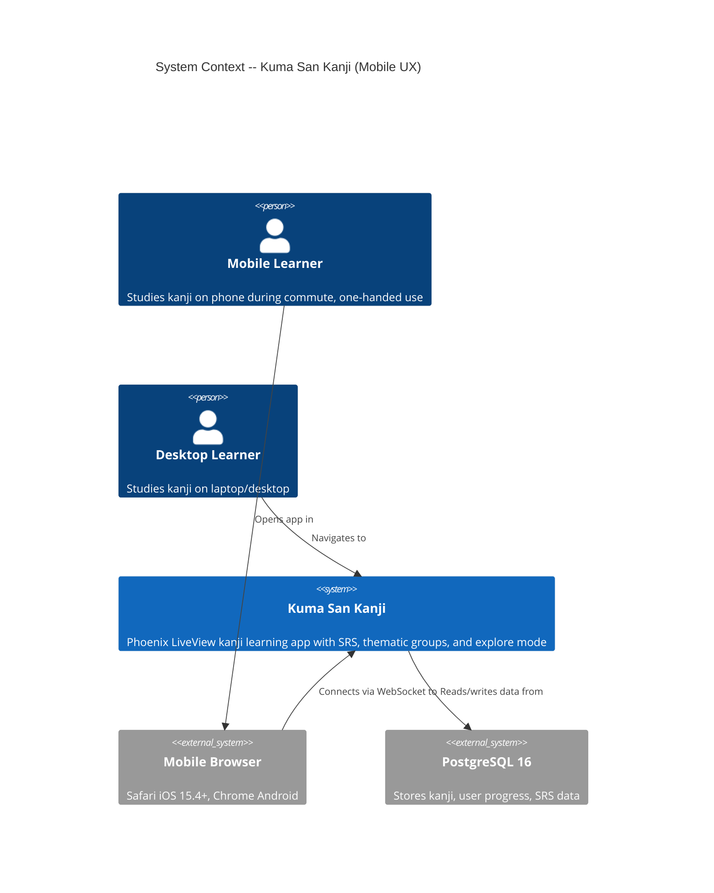
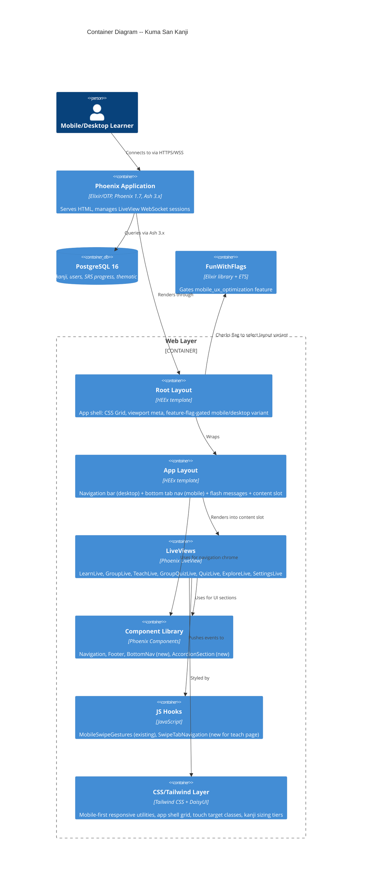
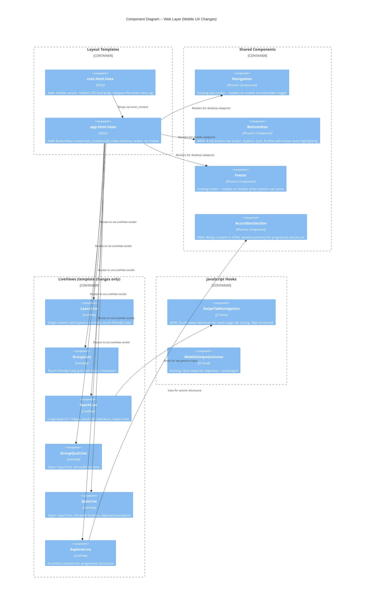

# Architecture: Mobile UX Optimization

**Feature ID**: mobile-ux-optimization
**Wave**: DESIGN
**Date**: 2026-03-11
**Architect**: Morgan (Solution Architect)
**Status**: Complete -- Ready for peer review

---

## 1. System Context and Capabilities

This feature adds mobile-first responsive UX to the existing Kuma San Kanji application. It is a **presentation-layer-only** change: no new domains, no new data models, no new API contracts. All modifications target the Phoenix LiveView layout templates, component library, CSS layer, and a single JavaScript hook.

### Capabilities

| ID | Capability | Scope |
|----|-----------|-------|
| C1 | Full-viewport app shell | Root layout CSS Grid with `100dvh` |
| C2 | Bottom tab navigation | New shared component in app layout |
| C3 | Safe area inset handling | Viewport meta tag + CSS env() variables |
| C4 | Responsive content layouts | Per-LiveView template CSS adjustments |
| C5 | Touch target optimization | CSS minimum sizing rules |
| C6 | Kanji sizing hierarchy | CSS classes for 48px/72-128px/72px+ tiers |
| C7 | Explore accordion sections | LiveView assigns + HTML details/summary |
| C8 | Swipe gesture navigation | JS hook for teach page tab swiping |
| C9 | iOS auto-zoom prevention | Input font-size >= 16px |
| C10 | Performance CSS | content-visibility, overscroll-behavior, prefers-reduced-motion |

### Feature Flag Gate

All capabilities gated behind `FunWithFlags.enabled?(:mobile_ux_optimization)`. The flag controls:
- App shell layout variant selection in `root.html.heex`
- Bottom nav rendering in `app.html.heex`
- Mobile header variant rendering in Navigation component

When the flag is OFF, the app renders identically to its current desktop-first layout.

---

## 2. C4 System Context (Level 1)



---

## 3. C4 Container (Level 2)



---

## 4. C4 Component (Level 3) -- Web Layer Detail

The web layer has 5+ internal components affected, warranting an L3 diagram.



---

## 5. Component Architecture and Boundaries

### 5.1 Boundary: Layout Templates (root + app)

**Responsibility**: Structural viewport management, navigation chrome selection, feature flag gating.

**Changes**:

| File | Current | Mobile UX Change |
|------|---------|-----------------|
| `root.html.heex` | `<body class="wabi-container min-h-screen flex flex-col pb-32">` | Add mobile variant: `h-[100dvh] grid grid-rows-[auto_1fr_auto]` when flag ON + mobile viewport. Desktop layout preserved. |
| `root.html.heex` | `<meta name="viewport" content="width=device-width, initial-scale=1">` | Add `viewport-fit=cover` for safe area inset activation |
| `app.html.heex` | Desktop navbar + main content | Add `BottomNav` component (mobile only), conditionally show/hide navbar and footer based on viewport |

**Key Constraint**: The root layout is a dead HTML template (not a LiveView). Feature flag checking happens at compile/render time via the `FeatureFlagHelper`. Mobile vs desktop toggle uses CSS responsive classes (`md:hidden` / `md:block`), not server-side conditionals, to avoid layout shifts.

### 5.2 Boundary: BottomNav Component (NEW)

**Responsibility**: Persistent 4-tab navigation bar for mobile viewports.

**Design Decisions** (see ADR-001):
- Uses DaisyUI `btm-nav` component as the base
- Fixed to bottom of viewport within CSS Grid row 3
- Active tab determined by matching `@current_path` prefix against tab route paths
- Each tab: icon (Heroicon) + label text, minimum 48x48px tap target
- Safe area padding via `pb-[env(safe-area-inset-bottom)]`
- Hidden on desktop (`md:hidden`)

**Inputs**: `current_path` (string, from socket assigns or conn)
**Outputs**: Rendered HTML with active tab highlighted

**Tab Routing**:

| Tab | Route Prefix | Icon | Auth Required |
|-----|-------------|------|---------------|
| Learn | `/learn` | `hero-academic-cap` | Yes |
| Explore | `/explore` | `hero-magnifying-glass` | No |
| Quiz | `/quiz` | `hero-pencil-square` | Yes |
| Profile | `/settings` (auth) or `/sign-in` (guest) | `hero-user` | No (adapts) |

### 5.3 Boundary: AccordionSection Component (NEW)

**Responsibility**: Progressive disclosure wrapper for explore page sections.

**Design Decision** (see ADR-003):
- Uses native HTML `<details>/<summary>` elements
- No JavaScript required, no LiveView assigns needed
- Accessible by default (keyboard, screen reader support built into HTML spec)
- CSS styling via DaisyUI `collapse` classes for consistency

**Inputs**: `title` (string), `open` (boolean, default false), inner block content
**Outputs**: Collapsible section with styled header

### 5.4 Boundary: SwipeTabNavigation Hook (NEW)

**Responsibility**: Detect horizontal swipe gestures on the teach page content area and push LiveView events to advance/retreat tabs.

**Design Decision** (see ADR-004):
- Horizontal swipe threshold: 50px minimum displacement
- Vertical displacement must be less than horizontal (prevents scroll interference)
- Swipe left: push `"next_tab"` event to LiveView
- Swipe right: push `"prev_tab"` event to LiveView
- Integrates with existing `handle_event("next_tab")` and `handle_event("prev_tab")` in TeachLive
- Does NOT conflict with existing `MobileSwipeGestures` hook (different element, different page)

**Separation from existing hooks**: The existing `MobileSwipeGestures` hook is bound to the QuizLive page and pushes `"next_kanji"` / `"skip_kanji"` events. The new `SwipeTabNavigation` hook is bound exclusively to the TeachLive content area and pushes tab navigation events. They operate on different LiveView processes and different DOM elements.

### 5.5 Boundary: CSS Layer Changes

**Responsibility**: All responsive styling, touch targets, kanji sizing, safe areas, performance CSS.

**Approach**: CSS additions only, never replacements. All mobile styles use Tailwind responsive prefixes or CSS `@media` queries.

| CSS Change | Implementation |
|-----------|---------------|
| App shell grid | Tailwind classes on body: `md:min-h-screen md:flex md:flex-col` (desktop), `h-[100dvh] grid grid-rows-[auto_1fr_auto]` (mobile) |
| Touch targets | Utility class `.touch-target-48` = `min-w-[48px] min-h-[48px]` applied to interactive elements on mobile |
| Kanji sizing | `.kanji-list` (48px), `.kanji-detail` (72-128px), `.kanji-quiz` (72px+) responsive classes |
| Safe area insets | `pb-[env(safe-area-inset-bottom)]` on bottom nav, `pt-[env(safe-area-inset-top)]` on header |
| iOS zoom prevention | `text-base` (16px+) on all `<input>` elements |
| Performance | `content-visibility: auto` on off-screen sections, `overscroll-behavior: contain` on scroll areas |
| Reduced motion | `@media (prefers-reduced-motion: reduce)` disables transitions |

### 5.6 Boundary: LiveView Template Changes

Each LiveView receives CSS-only modifications to its render template. No domain logic, no new assigns (except accordion state in ExploreLive), no new queries.

| LiveView | Mobile Changes |
|----------|---------------|
| LearnLive | Single-column cards (`grid-cols-1` on mobile), larger stat text, touch-friendly card targets |
| GroupLive | Kanji grid cells 48px+, full-width CTA button, touch-friendly grid cells |
| TeachLive | Kanji display 72-128px, tab indicators 48px+ touch targets, `SwipeTabNavigation` hook binding, full-width Next/Back buttons |
| GroupQuizLive | Input font 16px+, full-width submit, feedback card mobile layout |
| QuizLive | Input font 16px+, full-width buttons, keyboard avoidance scroll |
| ExploreLive | AccordionSection wrappers around secondary content, primary info (kanji, grade, meanings) always visible |

---

## 6. Open Questions Resolution

### Q1: Should bottom nav use DaisyUI `btm-nav` component or custom?

**Decision**: Use DaisyUI `btm-nav` component.

**Rationale**: DaisyUI is already the design system. The `btm-nav` component provides:
- Built-in active state styling consistent with the theme
- Proper fixed positioning
- Responsive design tokens
- Accessibility attributes

Customization is limited to adding safe area padding and Heroicon integration, which are CSS additions on top of the DaisyUI base. Building custom duplicates work DaisyUI already does and risks theme inconsistency.

### Q2: How should compact mobile header differ from desktop navbar?

**Decision**: Hide the desktop navbar entirely on mobile (`hidden md:block`). The bottom tab bar replaces all primary navigation. The mobile header row in the CSS Grid shows only the page title (from `@page_title` assign) in a compact bar.

**Rationale**: Research shows top navbar is the hardest to reach on mobile (Fitts's Law). The bottom tab bar provides all navigation. Keeping both wastes precious vertical space. The compact header (page title only) provides orientation without consuming interaction space.

**Implementation**: The Navigation component gains a `hidden md:block` class. A new minimal header renders in the app layout's header slot showing only page title + optional back arrow for sub-pages (group detail, teach, quiz).

### Q3: Should accordion sections use `<details>/<summary>` HTML or LiveView assigns?

**Decision**: Use native HTML `<details>/<summary>` elements, styled with DaisyUI `collapse` classes.

**Rationale** (see ADR-003 for full analysis):
- Zero JavaScript required
- Zero additional LiveView round-trips for open/close
- Built-in keyboard accessibility (Enter/Space to toggle)
- Built-in screen reader support (expanded/collapsed state announced)
- `open` attribute is HTML-native state management
- DaisyUI `collapse` classes provide consistent themed styling
- LiveView assigns would require a server round-trip for each accordion toggle, adding latency for a purely cosmetic interaction

### Q4: Swipe distance threshold for JS hook?

**Decision**: 50px minimum horizontal displacement, with the constraint that horizontal displacement must exceed vertical displacement.

**Rationale**: Research recommends 50px as the threshold for intentional swipe gestures. Below 50px risks false positives from imprecise touch. The horizontal > vertical constraint prevents swipe detection during normal vertical scrolling.

**Configuration**: The threshold is defined as a constant in the JS hook. It is not configurable at runtime (no need -- this is a well-researched UX standard).

### Q5: How should skeleton loading states be implemented in LiveView?

**Decision**: CSS-based skeleton states using Tailwind `animate-pulse` on placeholder elements, rendered during the LiveView `mount` connected phase.

**Rationale**: LiveView already has a two-phase render: disconnected (static HTML) and connected (live data). The disconnected render naturally serves as a loading state. For R4 (Performance), adding `animate-pulse` placeholder divs to the disconnected render provides visual feedback without additional assigns or JavaScript. This is the standard Phoenix LiveView pattern.

---

## 7. Technology Stack

All technologies are existing in the project. No new dependencies are introduced.

| Technology | Version | License | Role | Rationale |
|-----------|---------|---------|------|-----------|
| Elixir | 1.17+ | Apache 2.0 | Application language | Existing |
| Phoenix | 1.7+ | MIT | Web framework | Existing |
| Phoenix LiveView | 1.0+ | MIT | Real-time UI | Existing |
| Ash Framework | 3.x | MIT | Domain framework | Existing |
| Tailwind CSS | 3.x | MIT | Utility CSS framework | Existing |
| DaisyUI | 4.x | MIT | Component library | Existing -- `btm-nav`, `collapse` components used |
| FunWithFlags | 1.x | MIT | Feature flags | Existing -- `mobile_ux_optimization` flag |
| Heroicons | 2.x | MIT | Icon set | Existing -- icons for bottom nav tabs |

**No new dependencies**: This is a critical design constraint. All mobile UX changes are achievable with the existing stack. The DaisyUI `btm-nav` and `collapse` components are already available (DaisyUI is already installed). Heroicons are already bundled via the Tailwind plugin.

---

## 8. Integration Patterns

### 8.1 Feature Flag Integration

```
FeatureFlagHelper.mobile_ux_enabled?()
  -> FunWithFlags.enabled?(:mobile_ux_optimization)
  -> Returns boolean
```

**Usage points**:
- `root.html.heex`: Selects body class (mobile grid vs desktop flex)
- `app.html.heex`: Conditionally renders BottomNav component
- Navigation component: Class toggle for mobile hiding

**Note**: Mobile vs desktop CSS responsive toggling (`md:hidden`) operates independently of the feature flag. The feature flag gates whether the mobile-specific layout structure (grid, bottom nav) exists at all. Responsive classes handle the viewport-size switching.

### 8.2 Active Tab Route Matching

The BottomNav component receives the current request path and matches it against tab prefixes:

| Tab | Matches |
|-----|---------|
| Learn | `/learn`, `/learn/*` |
| Explore | `/explore`, `/radicals/*` |
| Quiz | `/quiz`, `/learn/*/quiz` |
| Profile | `/settings` |

The matching uses `String.starts_with?/2` on the current path. The Quiz tab has a special case: group quiz routes (`/learn/:slug/quiz`) also highlight the Quiz tab since the user is in a quiz context.

### 8.3 LiveView Event Integration (Swipe Hook)

The `SwipeTabNavigation` hook integrates with TeachLive's existing event handlers:

```
User swipe left on teach page content area
  -> JS Hook detects horizontal swipe > 50px
  -> Hook calls this.pushEvent("next_tab", {})
  -> TeachLive.handle_event("next_tab", ...) executes (EXISTING handler)
  -> Socket assigns updated, tab content re-rendered
```

No new server-side event handlers are needed. The existing `"next_tab"` and `"prev_tab"` handlers in TeachLive already handle the tab cycling logic.

### 8.4 Layout Slot Architecture

Current layout chain:
```
root.html.heex (body structure)
  -> app.html.heex (navbar + flash + content)
    -> LiveView render (page content)
```

Mobile layout chain (same templates, different CSS):
```
root.html.heex (CSS Grid body when flag ON)
  -> app.html.heex (mobile header + flash + content + BottomNav)
    -> LiveView render (responsive page content)
```

The layout chain is unchanged structurally. Only CSS classes and conditional component rendering differ.

---

## 9. Quality Attribute Strategies

### 9.1 Usability (Primary Driver)

- All interactive elements >= 48x48px tap targets on mobile
- Three-tier kanji sizing for readability: 48px (list), 72-128px (detail), 72px+ (quiz)
- Input font size >= 16px to prevent iOS auto-zoom
- Bottom nav in natural thumb zone for one-handed use
- Progressive disclosure (accordions) to reduce cognitive load on explore page

### 9.2 Compatibility

- Desktop layout unchanged when feature flag OFF
- Desktop layout unchanged when feature flag ON and viewport >= 768px
- CSS additions only, never replacements or overrides of existing desktop rules
- `100dvh` supported in Safari 15.4+, Chrome 108+ (acceptable for target audience per DISCUSS D1)
- Graceful fallback: `100vh` for older browsers via `height: 100vh; height: 100dvh;`

### 9.3 Performance

- No additional network requests (no new JS libraries, no new fonts, no new images)
- No additional server round-trips (accordion uses HTML-native state, CSS handles responsive layout)
- `content-visibility: auto` for off-screen explore sections (R4)
- `overscroll-behavior: contain` prevents scroll chaining (R4)
- `prefers-reduced-motion` media query disables animations (R4)
- Skeleton loading via CSS `animate-pulse` (no JS) (R4)

### 9.4 Maintainability

- Single feature flag for entire feature (not per-release flags)
- All mobile CSS uses standard Tailwind responsive prefixes -- no custom media queries
- New components (BottomNav, AccordionSection) follow existing project component conventions
- SwipeTabNavigation hook follows existing MobileSwipeGestures hook pattern

### 9.5 Reliability

- Feature flag enables instant rollback if mobile layout causes issues
- HTML `<details>/<summary>` has no failure mode (native browser element)
- Swipe gesture failure degrades gracefully to tap-only interaction (existing buttons still work)
- `100dvh` fallback to `100vh` ensures layout works even in unsupported browsers

### 9.6 Accessibility

- Bottom nav tab items include `aria-label` attributes
- Accordion sections use semantic `<details>/<summary>` (screen reader announces expanded/collapsed)
- Touch targets exceed WCAG 2.2 AAA recommendation (48px > 44px minimum)
- `prefers-reduced-motion` respected for all CSS transitions
- Color contrast maintained through DaisyUI theme system (existing)

---

## 10. Deployment Architecture

No deployment changes required. The feature is entirely client-side CSS and template modifications behind a feature flag.

**Rollout plan**:
1. Deploy code with feature flag OFF (no user impact)
2. Enable flag for admin users (internal testing)
3. Enable flag for 10% of users (canary)
4. Monitor guardrail metrics (desktop session completion, page load time, test suite)
5. Enable for 100% of users

**Rollback**: Disable `mobile_ux_optimization` feature flag in admin UI (`/admin/feature-flags`). Immediate effect, no deploy needed.

---

## 11. Risk Mitigations

| Risk | Level | Mitigation |
|------|-------|------------|
| Bottom nav conflicts with LiveView flash messages | HIGH | Flash messages render inside the content area (Grid row 2), not overlapping bottom nav (Grid row 3). Test with all flash variants. |
| `100dvh` + CSS Grid conflicts with LiveView reconnection banner | HIGH | Reconnection banner renders inside `<main>` content area. Verify banner does not push content below fold. |
| Safe area insets vary across iPhone models | MEDIUM | Use `env(safe-area-inset-*)` which auto-adapts. Test on iPhone SE, 14, 15 Pro via BrowserStack. |
| Swipe hook conflicts with LiveView event handling | MEDIUM | Hook bound to specific DOM element via `phx-hook`, scoped to teach page only. Different element than quiz swipe. |
| CSS Grid body breaks existing desktop layout | MEDIUM | Feature flag gates CSS Grid. Desktop body retains `min-h-screen flex flex-col`. Responsive classes handle transition. |
| `content-visibility: auto` causes layout shift | LOW | Only applied in R4, with explicit `contain-intrinsic-size` hints. |

---

## 12. Requirements Traceability

| User Story | Components Affected | Release |
|-----------|-------------------|---------|
| US-MOB-01: App Shell | root.html.heex, CSS layer | R1 |
| US-MOB-02: Bottom Tab Nav | BottomNav component, app.html.heex | R1 |
| US-MOB-03: Safe Area Insets | root.html.heex (viewport meta), CSS layer | R1 |
| US-MOB-04: Mobile Dashboard | LearnLive template | R2 |
| US-MOB-05: Kanji Grid | GroupLive template | R2 |
| US-MOB-06: Mobile Teach | TeachLive template | R2 |
| US-MOB-07: Mobile Quiz | GroupQuizLive + QuizLive templates | R2 |
| US-MOB-08: Quiz Results | GroupQuizLive template (summary section) | R2 |
| US-MOB-09: Swipe Navigation | SwipeTabNavigation hook, TeachLive | R3 |
| US-MOB-10: Explore Accordion | AccordionSection component, ExploreLive template | R3 |
| US-MOB-11: Typography | CSS layer (global text sizing rules) | R2 |
| US-MOB-12: Performance | CSS layer (content-visibility, reduced motion, skeleton) | R4 |

---

## 13. ADR Index

| ADR | Title | Status |
|-----|-------|--------|
| ADR-001 | Bottom Navigation -- DaisyUI btm-nav Component | Accepted |
| ADR-002 | Compact Mobile Header Strategy | Accepted |
| ADR-003 | Accordion Sections -- Native HTML details/summary | Accepted |
| ADR-004 | Swipe Gesture JS Hook Architecture | Accepted |
| ADR-005 | Skeleton Loading States -- CSS-Based Implementation | Accepted |
